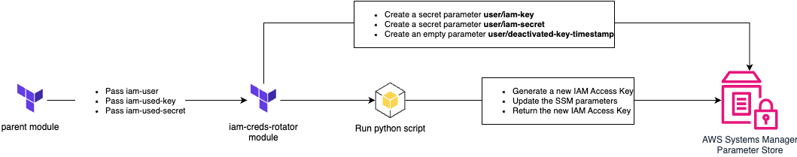
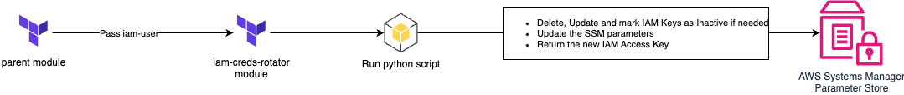
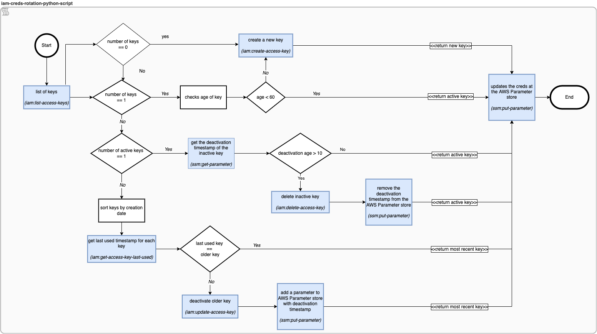

# AWS-IAM-Credential-Rotator-Terraform

## Description

The purpose of this repository is create a reusable terraform module to ensure the **rotation of IAM user key**. That includes creation, deletion and marking them as inactive. The repo is built on a use case where generation of new keys has to be reflected in terraform output. If it isnt your case also check out this [repo](https://github.com/AdventielFr/terraform-aws-iam-rotate-credentials) and [this](https://github.com/jessiehernandez/terraform-aws-database-credentials-rotator).

**Python** script has been used for this purpose. To run this module terraform or python user should have the permission of **list, get, create, deactivate and delete on IAM keys**. In addition to that permission of **get and put for System Manager** is needed.

The module will create, delete, or mark as inactive every time terraform apply runs. Module will not delete or inactive any key untill the new key is being used to ensure high availability.

For ensuring higher availability the expired key is not deleted immediately. It waits for the new key to be used first until then previous ones are not mark as inactive. This is why module is designed to keep only one active key. Make sure the user has only one active key or no key before you use this module to ensure the module correct flow.

### Pre-requisites

- Terraform > 0.14
- Python 3
- Install required python libraries.

```sh
pip install boto3 datetime awscli
```

### Module Usage:

If you have not created IAM keys via terraform. You can start using this module like following.

```bash
module "iam_key_rotation" {
  source     = "git::ssh://git@ssh.gitlab.rnd.mendix.com/dvas/iam-creds-rotation.git?ref=v1.0.14"
  iam_user   = module.<your_module_name>.user_name
  region     = var.region
}
 
output "my_module_iam_key" {
  value     = module.iam_key_rotation.updated_iam_key
  sensitive = true
}
 
output "my_module_iam_secret" {
  value     = module.iam_key_rotation.updated_iam_secret
  sensitive = true
}
```

## Migrating old keys created via terraform

### First Run:



1. The main module passes the current IAM user and used access key credentials to the iam-creds-rotator module
2. The module creates 3x parameters to capture the current used key for the specified user
3. The python script checks if the used key’s age is older than the specified max age (Check the script workflow for a deeper dive)
- if so, it generates a new key, updates the SSM parameters and returns the new generated key to be used
- if not, it returns the current key with no changes
4. The main module uses the new access key

### Subsequent Runs:



1. The main module passes the current IAM user to the iam-creds-rotator module
2. The python script checks if the newly generated key is used and the old key hasn’t been used for a specified period (Check the script workflow for a deeper dive)
- If so, the script marks the old key as inactive and schedule for deletion after a specified period, it also updates the needed SSM parameters accordingly
- If not, it returns the newly generated key
3. The main module uses the new access key

### Step-1 (Pre-requisites)

**Module requirements:**

- Ensure the module inputs, previously created user and its genrated keys.

### Step-2 (Module call)

Following code example shows how it can be integrated in a terraform stack.

```sh
module "iam_key_rotation" {
    source          = "git_repo_link"
    iam_user        = <previously_created_username>
    iam_key         = <previously_created_iam_key>
    iam_secret      = <previously_created_iam_secret>
}
```

### Step-3 (Adjust output)

Make sure to output the IAM key and secret from IAM rotation module. Your **output.tf** should look like following.

```sh
output "stack_iam_key" {
    value       = module.iam_key_rotation.update_iam_key
    sensitive   = true
}

output "stack_iam_secret" {
    value       = module.iam_key_rotation.update_iam_secret
    sensitive   = true
}
```

### Step-4 (Terraform apply to get keys out of terraform state)

Run terraform apply. In this way your old keys will come out of terraform state. You can verify this in AWS system manager parameter store. You will see the parameters initialized with old keys created via terraform.

### Step-5 (Remove the key creation created previously)

Remove the key creation and any outputs related to that.

```sh
#resource "aws_iam_access_key" "iam_user_test" {
#  user = aws_iam_user.iam_user_test.name
#}
```

### Step-6 (Adjust module call)

Now remove the IAM access key and secret as a input of module.  It should look likle this.

```hcl
module "iam_key_rotation" {
  source     = "git_repo_link"
  iam_user   = module.<your_module_name>.user_name
  region     = var.region
}
```

### Step-7: Terraform apply to finish

## DeepDive in rotation script



## Notes


This module creates 3 SSM parameters and 1 CMK to encrypt those SSM parameters. Following are the purpose of those SSM params.

- 2 SSM parameters as secure string for **-->** Maintaining IAM access key and secret
- 1 SSM parameter for **-->** Maintaining the deletion time stamp of a key and secret.
- 1 CMK for **-->** Encryption key to encrypt access key and secret.

## Clean-up

- Make sure to revert the outputs in your stack to old ones
- Run the following command to destroy the module
    ```terraform destroy module.iam_key_rotation```
- Make sure no SSM parameter and CMK destroy. 